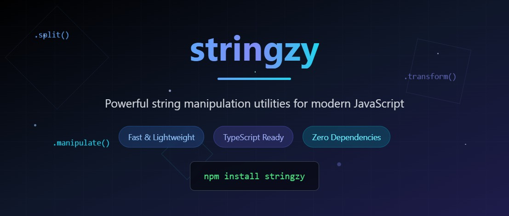

<div align="center">
  
  
  


[](https://github.com/ellerbrock/open-source-badges/)
[](http://makeapullrequest.com)

**A lightweight, zero-dependency NPM Package for elegant string manipulations. It provides a comprehensive range of text utilities for JavaScript and Node.js applications including transformations, validations, analysis, and formatting.**

[Checkout our Contributors!](#contri)


[Join the Community!](#community)


</div>


## ✨ Features

- 💪 **Powerful** - Transform, validate, analyze, and format strings with minimal code
- 🪶 **Lightweight** - Zero dependencies, tiny footprint
- 🧩 **Modular** - Import only what you need with organized namespaces
- 🚀 **Fast** - Optimized for performance
- ✅ **Tested** - Reliable and robust
- 🎯 **Comprehensive** - 4 specialized modules for all string needs

## 📦 Installation

```bash
# Using npm
npm install stringzy

# Using yarn
yarn add stringzy

# Using pnpm
pnpm add stringzy
```

## 🚀 Quick Start

```javascript
// Import the entire library
import stringzy from 'stringzy';

// Or import specific functions
import { toUpperCase, isEmail, wordCount, formatPhone } from 'stringzy';

// Or import by namespace
import { transform, validate, analyze, format } from 'stringzy';

// Transform your strings
const slug = stringzy.toSlug('Hello World!'); // 'hello-world'
const isValid = stringzy.validate.isEmail('user@example.com'); // true
const count = stringzy.analyze.wordCount('Hello world'); // 2
```

## 📋 Table of Contents

###  Transformations
- [truncateText](#truncatetext) - Truncates text to a specified maximum length
- [toSlug](#toslug) - Converts a string to a URL-friendly slug
- [capitalizeWords](#capitalizewords) - Capitalizes the first letter of each word
- [removeSpecialChars](#removespecialchars) - Removes special characters from a string
- [removeWords](#removewords) - Removes specified words from a string
- [removeDuplicates](#removeduplicates) - Removes duplicate words from a string
- [initials](#initials) - Extracts initials from a text string
- [camelCase](#camelcase) - Converts the given string to Camel Case
- [pascalCase](#pascalcase) - Converts the given string to Pascal Case
- [snakeCase](#snakecase) - Converts the given string to Snake Case   
- [kebabCase](#kebabcase) - Converts the given string to Kebab Case
- [titleCase](#titlecase) - Converts the given string to Title Case
- [constantCase](#constantcase) - Converts the given string to Constant Case
- [escapeHTML](#escapehtml) - Escapes HTML special characters to prevent XSS attacks

###  Validations
- [isURL](#isurl) - Checks if a string is a valid URL
- [isEmail](#isemail) - Checks if a string is a valid email address
- [isDate](#isdate) - Checks if a string is a valid date
- [isEmpty](#isempty) - Checks if a string is empty or contains only whitespace
- [isSlug](#isslug) - Checks if a string is a valid slug
- [isIPv4](#isipv4) - Checks if a string is a valid IPv4 address
- [isHexColor](#ishexcolor) - Checks if the input string is a valid hex color

###  Analysis
- [wordCount](#wordcount) - Counts the number of words in a string
- [readingDuration](#readingduration) - Calculates the reading duration of a given string
- [characterCount](#charactercount) - Counts the number of characters in a string
- [characterFrequency](#characterfrequency) - Analyzes character frequency in a string

###  Formatting
- [capitalize](#capitalize) - Capitalizes the first letter of each word
- [formatNumber](#formatnumber) - Formats a number string with thousand separators
- [formatPhone](#formatphone) - Formats a phone number string to standard format

## 📋 API Reference

### 🔄 Transformations

Functions for transforming and manipulating strings.

#### <a id="truncatetext"></a>`truncateText(text, maxLength, suffix = '...')`

Truncates text to a specified maximum length, adding a suffix if truncated.

```javascript
import { truncateText } from 'stringzy';

truncateText('This is a long sentence that needs truncating', 10);
// Returns: 'This is a...'

truncateText('This is a long sentence', 10, ' →');
// Returns: 'This is a →'

truncateText('Short', 10);
// Returns: 'Short' (no truncation needed)
```

| Parameter | Type | Default | Description |
|-----------|------|---------|-------------|
| text | string | required | The input string to truncate |
| maxLength | number | required | Maximum length of the output string (excluding suffix) |
| suffix | string | '...' | String to append if truncation occurs |

#### <a id="toslug"></a>`toSlug(text)`

Converts a string to a URL-friendly slug.

```javascript
import { toSlug } from 'stringzy';

toSlug('Hello World!');
// Returns: 'hello-world'

toSlug('This is a TEST string 123');
// Returns: 'this-is-a-test-string-123'

toSlug('Special $#@! characters');
// Returns: 'special-characters'
```

| Parameter | Type | Default | Description |
|-----------|------|---------|-------------|
| text | string | required | The input string to convert to a slug |

#### <a id="capitalizewords"></a>`capitalizeWords(text)`

Capitalizes the first letter of each word in a string.

```javascript
import { capitalizeWords } from 'stringzy';

capitalizeWords('hello world');
// Returns: 'Hello World'

capitalizeWords('javascript string manipulation');
// Returns: 'Javascript String Manipulation'

capitalizeWords('already Capitalized');
// Returns: 'Already Capitalized'
```

| Parameter | Type | Default | Description |
|-----------|------|---------|-------------|
| text | string | required | The input string to capitalize |

#### <a id="removespecialchars"></a>`removeSpecialChars(text, replacement = '')`

Removes special characters from a string, optionally replacing them.

```javascript
import { removeSpecialChars } from 'stringzy';

removeSpecialChars('Hello, world!');
// Returns: 'Hello world'

removeSpecialChars('email@example.com');
// Returns: 'emailexamplecom'

removeSpecialChars('Phone: (123) 456-7890', '-');
// Returns: 'Phone-123-456-7890'
```

| Parameter | Type | Default | Description |
|-----------|------|---------|-------------|
| text | string | required | The input string to process |
| replacement | string | '' | String to replace special characters with |

#### <a id="removewords"></a>`removeWords(text, wordsToRemove)`

Removes specified words from a string

```javascript
import { removeWords } from 'stringzy';

removeWords('Hello world this is a test', ['this', 'is']);
// Returns: 'Hello world a test'

removeWords('Remove The Quick BROWN fox', ['the', 'brown']);
// Returns: 'Remove Quick fox' 

removeWords('JavaScript is awesome and JavaScript rocks', ['JavaScript']);
// Returns: 'is awesome and rocks'
```

| Parameter | Type | Default | Description |
|-----------|------|---------|-------------|
| text | string | required | The input string to process |
| wordsToRemove | string[] | required | Array of words to remove from the string |

#### <a id="removeduplicates"></a>`removeDuplicates(text)`

Removes duplicate case-sensitive words from a given text. 

```javascript
import { removeDuplicates } from 'stringzy';

removeDuplicates('Hello world this is a is a test');
// Returns: 'Hello world this is a test'

removeDuplicates('Remove me me me me or Me');
// Returns: 'Remove me or Me' 

removeDuplicates('JavaScript is not bad and not awesome');
// Returns: 'JavaScript is not bad and awesome'
```

| Parameter | Type | Default | Description |
|-----------|------|---------|-------------|
| text | string | required | The input string to process |

#### <a id="initials"></a>`initials(text, limit)`

Extracts initials from a text string.

```javascript
import { initials } from 'stringzy';

initials('John Doe');
// Returns: 'JD'

initials('Alice Bob Charlie', 2);
// Returns: 'AB'

initials('Hello World Test Case');
// Returns: 'HWTC'

initials('single');
// Returns: 's'

initials('  Multiple   Spaces   Between  ');
// Returns: 'MSB'
```

| Parameter | Type | Default | Description |
|-----------|------|---------|-------------|
| text | string | required | The input string to extract initials from |
| limit | number | undefined | Maximum number of initials to return (optional) |

#### <a id="camelcase"></a>`camelCase(text)`

Converts the given string to Camel Case.

```javascript
import { camelCase } from 'stringzy';

camelCase('hello world'); // 'helloWorld'
camelCase('this is a test'); // 'thisIsATest' 
``` 
| Parameter | Type | Default | Description |
|-----------|------|---------|-------------|
| text | string | required | The input string to convert to Camel Case |


#### <a id="pascalcase"></a>`pascalCase(text)`
Converts the given string to Pascal Case.

```javascript
import { pascalCase } from 'stringzy';


pascalCase('hello world'); // 'HelloWorld'
pascalCase('this is a test'); // 'ThisIsATest'
```
| Parameter | Type | Default | Description |
|-----------|------|---------|-------------|
| text | string | required | The input string to convert to Pascal Case |

#### <a id="snakecase"></a>`snakeCase(text)`

Converts the given string to Snake Case.

```javascript 
import { snakeCase } from 'stringzy';
snakeCase('hello world'); // 'hello_world'
snakeCase('this is a test'); // 'this_is_a_test'
```

| Parameter | Type | Default | Description |
|-----------|------|---------|-------------|
| text | string | required | The input string to convert to Snake Case |


#### <a id="kebabcase"></a>`kebabCase(text)`

Converts the given string to Kebab Case.

```javascript
import { kebabCase } from 'stringzy';


kebabCase('hello world'); // 'hello-world'
kebabCase('this is a test'); // 'this-is-a-test'
``` 
| Parameter | Type | Default | Description |
|-----------|------|---------|-------------|
| text | string | required | The input string to convert to Kebab Case |


#### <a id="titlecase"></a>`titleCase(text)`

Converts the given string to Title Case.

```javascript
import { titleCase } from 'stringzy';


titleCase('hello world'); // 'Hello World'
titleCase('this is a test'); // 'This Is A Test'
```
| Parameter | Type | Default | Description |
|-----------|------|---------|-------------|
| text | string | required | The input string to convert to Title Case |

#### <a id="constantcase"></a>`constantCase(text)`
Converts the given string to Constant Case.

```javascript
import { constantCase } from 'stringzy';


constantCase('hello world'); // 'HELLO_WORLD'
constantCase('this is a test'); // 'THIS_IS_A_TEST'

```
| Parameter | Type | Default | Description |
|-----------|------|---------|-------------|
| text | string | required | The input string to convert to Constant Case |

#### <a id="escapehtml"></a>`escapeHTML(text)`

Escapes HTML special characters to prevent XSS attacks by converting them to their HTML entities.

```javascript
import { escapeHTML } from 'stringzy';

escapeHTML('Tom & Jerry');
// Returns: 'Tom &amp; Jerry'

escapeHTML('<script>alert("XSS")</script>');
// Returns: '&lt;script&gt;alert(&quot;XSS&quot;)&lt;/script&gt;'

escapeHTML('<div class="test">content</div>');
// Returns: '&lt;div class=&quot;test&quot;&gt;content&lt;/div&gt;'

escapeHTML('Say "Hello" & it\'s < 5 > 2');
// Returns: 'Say &quot;Hello&quot; &amp; it&#39;s &lt; 5 &gt; 2'
```

| Parameter | Type | Default | Description |
|-----------|------|---------|-------------|
| text | string | required | The input string to escape HTML characters from |

---

### ✅ Validations

Functions for validating string formats and content.

#### <a id="isurl"></a>`isURL(text)`

Checks if a string is a valid URL.

```javascript
isURL('https://example.com'); // true
isURL('not-a-url'); // false
```

| Parameter | Type | Default | Description |
|-----------|------|---------|-------------|
| text | string | required | The input string to validate as URL |

#### <a id="isemail"></a>`isEmail(text)`

Checks if a string is a valid email address.

```javascript
isEmail('user@example.com'); // true
isEmail('invalid-email'); // false
```

| Parameter | Type | Default | Description |
|-----------|------|---------|-------------|
| text | string | required | The input string to validate as email |

#### <a id="isdate"></a>`isDate(text)`

Checks if a string is a valid date.

```javascript
import { isDate } from 'stringzy';

isDate('2023-12-25'); // true
isDate('12/25/2023'); // true
isDate('invalid-date'); // false
isDate('2023-13-45'); // false
```

| Parameter | Type | Default | Description |
|-----------|------|---------|-------------|
| text | string | required | The input string to validate as date |

#### <a id="isempty"></a>`isEmpty(text)`

Checks if a string is empty or contains only whitespace.

```javascript
isEmpty('   '); // true
isEmpty('hello'); // false
```

| Parameter | Type | Default | Description |
|-----------|------|---------|-------------|
| text | string | required | The input string to check for emptiness |

#### <a id="isslug"></a>`isSlug(text)`

Checks if a string is a valid slug.

```javascript
isSlug("hello-world");         // true
isSlug("test-product-123");    // true
isSlug("Hello-World");         // false (uppercase letters)
isSlug("hello--world");        // false (consecutive hyphens)
isSlug("-hello-world");        // false (starts with hyphen)
isSlug("hello_world");         // false (underscore not allowed)
```

| Parameter | Type | Default | Description |
|-----------|------|---------|-------------|
| text | string | required | The input string to validate as slug |

#### <a id="isipv4"></a>`isIPv4(text)`

Checks if a string is a valid IPv4 address.

```javascript
import { isIPv4 } from 'stringzy';

isIPv4('192.168.1.1'); // true
isIPv4('0.0.0.0'); // true
isIPv4('256.1.1.1'); // false (out of range)
isIPv4('192.168.1'); // false (incomplete)
isIPv4('192.168.01.1'); // false (leading zeros)
isIPv4('192.168.1.a'); // false (non-numeric)
```

| Parameter | Type | Default | Description |
|-----------|------|---------|-------------|
| text | string | required | The input string to validate as IPv4 address |


#### <a id="ishexcolor"></a>`isHexColor(text)`

Checks if a string is a valid Hex color.

```javascript
import { isHexColor } from 'stringzy';

isHexColor('#fff');       // true
isHexColor('fff');        // true
isHexColor('#a1b2c3');    // true
isHexColor('123abc');     // true
isHexColor('#1234');      // false
isHexColor('blue');       // false
```

| Parameter | Type | Default | Description |
|-----------|------|---------|-------------|
| text | string | required | The input string to validate as Hex color |

---


### 📊 Analysis

Functions for analyzing string content and structure.

#### <a id="readingduration"></a>`readingDuration(text, readingSpeed = 230)`

Calculates the estimated reading duration for a given text based on an average reading speed.

```javascript
import { readingDuration } from 'stringzy';

readingDuration('This is a sample text with twenty-three words to test the reading duration function.');
// Returns: 0 (23 words / 230 words per minute ≈ 0 minutes)

readingDuration('This text contains fifty words. It is designed to test the reading duration function with a larger input.', 200);
// Returns: 1 (50 words / 200 words per minute ≈ 1 minute)

readingDuration(Array(9999).fill('Word').join(' '));
// Returns: 43 (9999 words / 230 words per minute ≈ 43 minutes)
```

| Parameter      | Type     | Default | Description                                                                 |
|----------------|----------|---------|-----------------------------------------------------------------------------|
| text           | string   | required | The input text for which the reading duration is to be calculated           |
| readingSpeed   | number   | 230     | The reading speed in words per minute. Defaults to 230 (average reading speed) |


#### <a id="wordcount"></a>`wordCount(text)`

Counts the number of words in a string.

```javascript
wordCount('Hello world'); // 2
wordCount(''); // 0
```

| Parameter | Type | Default | Description |
|-----------|------|---------|-------------|
| text | string | required | The input string to count words in |

#### <a id="charactercount"></a>`characterCount(text)`

Counts the number of characters in a string.

```javascript
characterCount('Hello'); // 5
```

| Parameter | Type | Default | Description |
|-----------|------|---------|-------------|
| text | string | required | The input string to count characters in |

#### <a id="characterfrequency"></a>`characterFrequency(text)`

Analyzes character frequency in a string (excluding spaces).

```javascript
characterFrequency('hello'); // { h: 1, e: 1, l: 2, o: 1 }
```

| Parameter | Type | Default | Description |
|-----------|------|---------|-------------|
| text | string | required | The input string to analyze character frequency |

---

### 🎨 Formatting

Functions for formatting strings into specific patterns.

#### <a id="capitalize"></a>`capitalize(text)`

Capitalizes the first letter of each word.

```javascript
capitalize('hello world'); // 'Hello World'
capitalize('javaScript programming'); // 'Javascript Programming'
```

| Parameter | Type | Default | Description |
|-----------|------|---------|-------------|
| text | string | required | The input string to capitalize |

#### <a id="formatnumber"></a>`formatNumber(number, separator = ',')`

Formats a number string with thousand separators.

```javascript
formatNumber('1234567'); // '1,234,567'
formatNumber('1234567', '.'); // '1.234.567'
```

| Parameter | Type | Default | Description |
|-----------|------|---------|-------------|
| number | string\|number | required | The number to format |
| separator | string | ',' | The separator to use for thousands |

#### <a id="formatphone"></a>`formatPhone(phone, format = 'us')`

Formats a phone number string to standard format.

```javascript
formatPhone('1234567890'); // '(123) 456-7890'
formatPhone('11234567890', 'international'); // '+1 (123) 456-7890'
```

| Parameter | Type | Default | Description |
|-----------|------|---------|-------------|
| phone | string | required | The phone number string to format |
| format | string | 'us' | Format type: 'us' or 'international' |

## 🔧 Usage Patterns

### Individual Function Imports
```javascript
import { isEmail, wordCount, capitalize } from 'stringzy';

const email = 'user@example.com';
if (isEmail(email)) {
  console.log('Valid email!');
}
```

### Namespace Imports
```javascript
import { validate, analyze, format } from 'stringzy';

// Organized by functionality
const emailValid = validate.isEmail('test@example.com');
const words = analyze.wordCount('Hello world');
const formatted = format.capitalize('hello world');
```

### Default Import (All Functions)
```javascript
import stringzy from 'stringzy';

// Access any function
stringzy.toUpperCase('hello');
stringzy.validate.isEmail('test@example.com');
stringzy.analyze.wordCount('Hello world');
stringzy.format.capitalize('hello world');
```

## 🛠️ Usage Examples

### In a React component

```jsx
import React from 'react';
import { truncateText, capitalize, wordCount, isEmpty } from 'stringzy';

function ArticlePreview({ title, content }) {
  const displayTitle = isEmpty(title) ? 'Untitled' : capitalize(title);
  const previewText = truncateText(content, 150);
  const readingTime = Math.ceil(wordCount(content) / 200);

  return (
    <div className="article-preview">
      <h2>{displayTitle}</h2>
      <p>{previewText}</p>
      <small>{readingTime} min read</small>
    </div>
  );
}
```

### Form Validation

```javascript
import { validate } from 'stringzy';

function validateForm(formData) {
  const errors = {};
  
  if (!validate.isEmail(formData.email)) {
    errors.email = 'Please enter a valid email address';
  }
  
  if (!validate.isURL(formData.website)) {
    errors.website = 'Please enter a valid URL';
  }
  
  if (validate.isEmpty(formData.name)) {
    errors.name = 'Name is required';
  }
  
  return errors;
}
```

### Content Analysis Dashboard

```javascript
import { analyze } from 'stringzy';

function getContentStats(text) {
  return {
    words: analyze.wordCount(text),
    characters: analyze.characterCount(text),
    frequency: analyze.characterFrequency(text),
    readingTime: Math.ceil(analyze.wordCount(text) / 200)
  };
}
```

### Data Formatting

```javascript
import { format } from 'stringzy';

function formatUserData(userData) {
  return {
    name: format.capitalize(userData.name),
    phone: format.formatPhone(userData.phone),
    revenue: format.formatNumber(userData.revenue)
  };
}
```

## 🔄 TypeScript Support

The package includes TypeScript type definitions for all functions.

```typescript
import { validate, analyze, format } from 'stringzy';

// TypeScript will provide proper type checking
const isValid: boolean = validate.isEmail('test@example.com');
const count: number = analyze.wordCount('Hello world');
const formatted: string = format.capitalize('hello world');
```

## 🏗️ Architecture

stringzy is organized into four specialized modules:

- **`transformations.js`** - Core string transformations
- **`validations.js`** - String validation utilities  
- **`analysis.js`** - String analysis and metrics
- **`formatting.js`** - String formatting functions

Each module can be imported individually or accessed through the main entry point.

## 🤝 Contributing

Contributions are welcome! Please read our [contribution guidelines](CONTRIBUTING.md) before submitting a pull request.


## <a id="contri"></a>`Contributors`

<table>
    <tbody>
        <tr>
        <td align="center">
                <a href="https://github.com/Samarth2190">
                    
                    <br />
                    <sub>
                        <b>Samarth Ruia</b>
                    </sub>
                </a>
            </td>
        <td align="center">
                <a href="https://github.com/JohnCervantes">
                    
                    <br />
                    <sub>
                        <b>John Cervantes</b>
                    </sub>
                </a>
            </td>
          <td align="center">
                <a href="https://github.com/thehardiik">
                    
                    <br />
                    <sub>
                        <b>Hardik Srivastav</b>
                    </sub>
                </a>
            </td>
          <td align="center">
                <a href="https://github.com/ahmedsemih">
                    
                    <br />
                    <sub>
                        <b>Ahmed Semih Erkan</b>
                    </sub>
                </a>
            </td>
            <td align="center">
                <a href="https://github.com/michaelvbend">
                    
                    <br />
                    <sub>
                        <b>Michael van der Bend</b>
                    </sub>
                </a>
            </td>
           <td align="center">
                <a href="https://github.com/mamphis">
                    
                    <br />
                    <sub>
                        <b>mamphis</b>
                    </sub>
                </a>
            </td>
        </tr>
    </tbody>
</table>

## <a id="community"></a>💬 Join the Community

Have questions, ideas, or want to contribute? Join our [Discord server](https://discord.gg/DmvY7XJMdk) to chat with the community, discuss features, and help shape the future of the project.

## 📝 License

This project is licensed under the MIT License - see the LICENSE file for details.

## 🙏 Acknowledgments

- Thank you to all contributors and users of this package!
- Inspired by the need for comprehensive yet simple string manipulation utilities.

If you have contributed to this project and your image is not here, please let us know, and we'll be happy to add it!

---

Made with ❤️ by Samarth Ruia